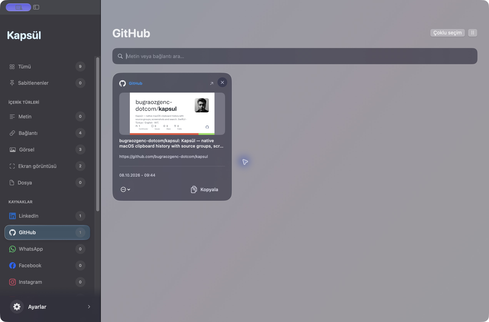
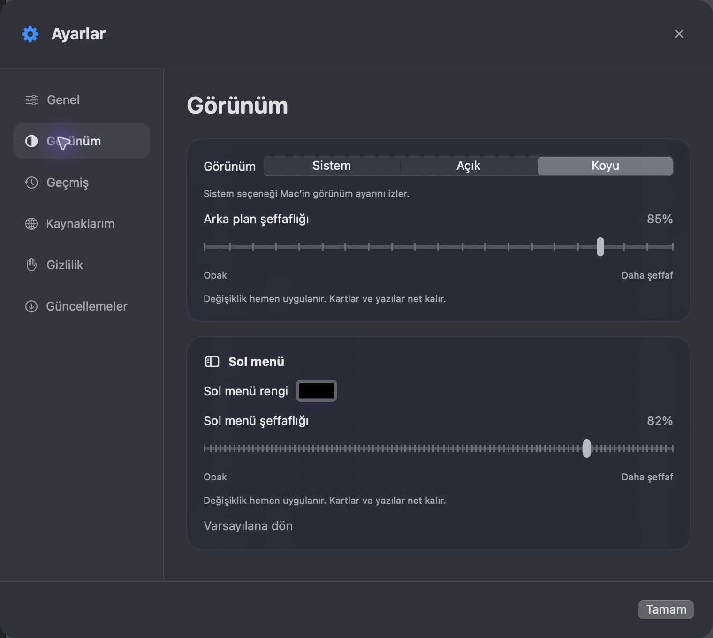

<p align="center"></p>

# Kapsül

Where did that link you just copied go? What about yesterday’s screenshot?

Kapsül keeps the text, links and images you copy on your Mac together, so you can search and copy them again when you need them. A small, free, open-source clipboard companion.

[Download DMG](https://github.com/bugraozgenc-dotcom/kapsul/releases/latest) · [Türkçe](README.md) · [User guide](docs/USAGE.en.md)


*These are real screenshots of the running Kapsül 0.6.0 app.*

## Get started

You’ll need macOS 14 or later.

1. Download **Kapsul-0.6.0-universal.dmg** from [the latest release](https://github.com/bugraozgenc-dotcom/kapsul/releases/latest). It includes Apple Silicon and Intel code.
2. Open the DMG and drag **Kapsül.app** to **Applications**.
3. Open Kapsül and copy something. Use **⌥ Space** to bring up history and **⌘ F** to search.

The package is ad hoc signed, without a Developer ID signature or Apple notarization. macOS may show a security warning; see the [installation guide](docs/USAGE.en.md). Runtime testing on Intel has not been performed.

## A few things you can do

- Search copied text, links, images, screenshots and file paths; filter by type or source.
- See item counts beside groups, with recently used sources first. Add your own domain groups.
- Extract text from images using on-device OCR. Click an image to open its larger preview.
- Pin items, add tags and collections, and use multiple selection to delete unwanted items together.
- Choose light, dark or system appearance. Adjust the glass background, sidebar color and transparency, and drag the sidebar divider to resize it.
- Launch at login, change the panel shortcut, and copy formatted or plain text.
- Pause capture, exclude apps, choose retention, and back up or restore history with its images.
- Check for updates in Settings and install new releases through Sparkle.

The interface supports Turkish, English, French, German and Spanish.





## Your history

History stays on this Mac in `~/Library/Application Support/CopyGlass/`, without additional app-level encryption. Kapsül does not provide its own cloud or phone sync. File paths are stored rather than file contents.

OCR runs locally. Link previews are off by default; enabling them makes requests to the linked websites. Update checks connect to GitHub.

Capture checks the clipboard about every 0.7 seconds while Kapsül is running, so very fast successive copies may be missed. Existing screenshots aren’t imported in bulk. The source website of plain text copied from a browser can’t always be identified. Pinned items also follow your chosen retention period.

## Help it grow

Kapsül is still growing. Found a rough edge or have an idea? Drop by [Issues](https://github.com/bugraozgenc-dotcom/kapsul/issues). Contributions are welcome too.

For details, see the [user guide](docs/USAGE.en.md), [library features](docs/LIBRARY.tr.md), [updates](docs/UPDATES.tr.md) and [0.6.0 release notes](docs/releases/v0.6.0.md).

## Build it yourself

On a Mac with Xcode and Command Line Tools:

```sh
git clone https://github.com/bugraozgenc-dotcom/kapsul.git
cd kapsul
scripts/build-app.sh
open "dist/Kapsül.app"
```

For a universal distribution:

```sh
scripts/check.sh
scripts/build-app.sh --release --universal
scripts/package-dmg.sh
(cd dist && shasum -a 256 -c Kapsul-0.6.0-universal.dmg.sha256)
```

Outputs are in `dist/`. You can also open `Package.swift` in Xcode. Set `COPYGLASS_VERSION` and `COPYGLASS_BUILD_NUMBER` to change the version, or `CODE_SIGN_IDENTITY` to use a valid Developer ID certificate. Notarization is separate. See the update guide for signed Sparkle archives.

Code is [MIT licensed](LICENSE). Brand icons follow the [Simple Icons notice](Sources/CopyGlass/Resources/NOTICE.txt); brand names belong to their owners.
