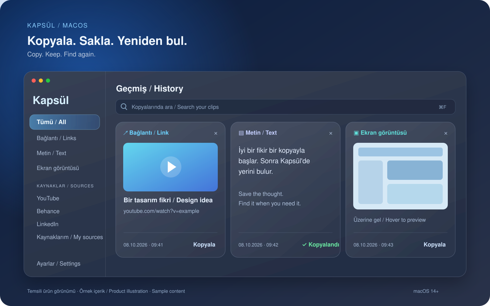
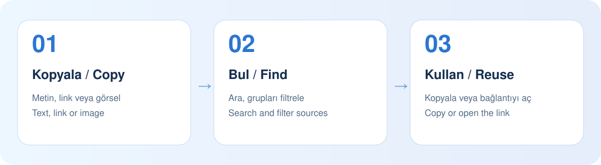

<p align="center"></p>

# Kapsül

**Copy. Keep. Find again.** An open-source clipboard history app for Mac. Find copied text, links, and images in one searchable panel, organized by source.

[Türkçe](README.md) · [Download DMG](https://github.com/bugraozgenc-dotcom/kapsul/releases/latest) · [English user guide](docs/USAGE.en.md)



*Product illustration using sample content.*

## Download and start

Requires **macOS 14 or later**. The universal package includes Apple Silicon and Intel code.

1. Download **Kapsul-0.4.0-universal.dmg** from [Releases](https://github.com/bugraozgenc-dotcom/kapsul/releases/latest).
2. Open the DMG and drag **Kapsül.app** to **Applications**.
3. Open the app and copy something in another app. New items appear automatically while Kapsül runs.

**This release is ad hoc signed, without a Developer ID signature or Apple notarization.** macOS may show a security warning. The [installation guide](docs/USAGE.en.md#installation) explains this. Runtime testing on Intel has not been performed.



## Features

- **Searchable panel:** Press ⌘F to search text or URLs; filter by type and source.
- **Links:** Click a card to open it in your browser; enable optional title and thumbnail previews.
- **Images and screenshots:** Capture new screenshots; hover to open a larger preview and copy the image.
- **Sources:** LinkedIn, WhatsApp, Facebook, Instagram, YouTube, Behance, Medium, X, TikTok, Reddit, Pinterest, GitHub, Dribbble, Vimeo, Telegram, and Discord. Add your own domain groups in Settings.
- **Organization:** Item timestamps, pinning, confirmed deletion, and animated green copy feedback.
- **Retention:** 1 month, 3 months, 1 year, or Forever.
- **Appearance and language:** Light, dark, or system appearance; Turkish, English, French, German, and Spanish.
- **Native macOS interface:** SwiftUI, glass layers, menu-bar access, and pause/resume capture.

## Usage and data

The [English guide](docs/USAGE.en.md) and [Türkçe rehber](docs/USAGE.tr.md) cover installation, search, previews, custom sources, and settings.

History stays on this Mac in `~/Library/Application Support/CopyGlass/`, without additional application-level encryption. Link previews are off by default; enabling them sends requests to the linked websites. Files are stored as path references, not content backups. Pinned items follow the retention policy too.

Kapsül checks the clipboard about every 0.7 seconds while running; rapid successive copies may be missed. Existing screenshots are not imported in bulk. The website behind plain text copied from a browser cannot always be identified. Phone and cloud synchronization are not included.

## Build from source

Use a Mac with Xcode and Command Line Tools installed. You can also open `Package.swift` in Xcode.

```sh
git clone https://github.com/bugraozgenc-dotcom/kapsul.git
cd kapsul
scripts/build-app.sh
open "dist/Kapsül.app"
```

Build a release app and DMG:

```sh
scripts/check.sh
scripts/build-app.sh --release --universal
scripts/package-dmg.sh
(cd dist && shasum -a 256 -c Kapsul-0.4.0-universal.dmg.sha256)
```

Outputs are written to `dist/`. Temporary files stay in the local cache. Set `COPYGLASS_VERSION` and `COPYGLASS_BUILD_NUMBER` to change the version. With a valid **Developer ID Application** certificate, set `CODE_SIGN_IDENTITY` to use it; notarization is a separate step. Ad hoc signing is the default.

GitHub Actions runs checks on pushes and pull requests. **Actions → macOS checks → Run workflow** also builds a universal app and DMG, available as workflow artifacts.

## License and contributions

Source code is [MIT licensed](LICENSE). Brand icons are covered by the [Simple Icons notice](Sources/CopyGlass/Resources/NOTICE.txt); trademarks belong to their respective owners. Issues and pull requests are welcome. [0.4.0 release notes](docs/releases/v0.4.0.md).
